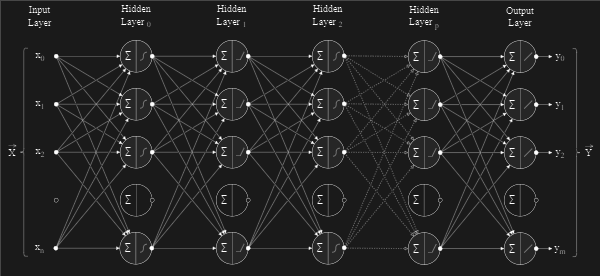
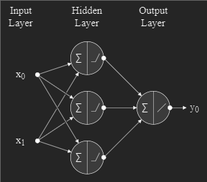
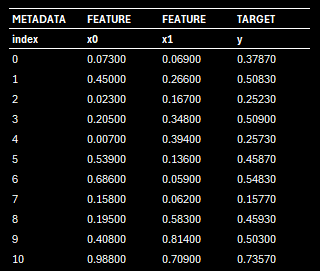

# Neural Network — Multi Layer Perceptron


<p align="center">
  
</p>

A general-purpose, from-scratch C++ implementation of a **multi-layer perceptron** (a fully connected, feed-forward neural network), with no external machine-learning libraries. The `NeuralNetwork` class supports configurable network architectures, multiple activation functions, both regression and classification, and is trained with backpropagation and (stochastic) gradient descent. The included console application demonstrates the library by training a network to add two numbers.

## 📑 Table of Contents

1. [✨ Features](#-features)
2. [🧠 Overview](#-overview)
3. [🚀 Usage](#-usage)
4. [🛠️ Building from Source](#️-building-from-source)
5. [🗂️ Project Structure](#️-project-structure)
6. [📄 License](#-license)

## ✨ Features

- **General-purpose `NeuralNetwork` class** — define the layer sizes and per-layer activation functions at construction time.
- **Arbitrary architecture** — fully connected feed-forward networks of any depth and width.
- **Activation functions** — Linear, Sigmoid, Tanh, and ReLU (with their derivatives), provided by the `MathAI` math library.
- **Training** — backpropagation with gradient descent / stochastic gradient descent, and configurable learning rate, epoch count, and mini-batch size.
- **Loss** — Mean Squared Error for regression tasks.
- **Inference** — both regression (`Predict`) and classification (`Classify`, returning the arg-max class).
- **Progress reporting** — per-epoch loss is written to a CSV log, and live training progress is printed to the console.
- **Zero dependencies** — pure standard C++ (`<vector>`, `<random>`, `<cmath>`, `<fstream>`, …); no third-party frameworks.
- **Self-contained demo** — generates synthetic data and trains a network end-to-end, then drops into an interactive test loop.

<br>

> **Note:**<br>The class also declares enums for Cross-Entropy loss and the Adam optimizer, plus `SaveModel` / `LoadModel` hooks. These are placeholders for future work. The implemented paths are MSE loss with gradient descent / SGD.

## 🧠 Overview

A multi-layer perceptron is a stack of fully connected layers. Each neuron computes a weighted sum of the previous layer's outputs plus a bias, then passes the result through an activation function. Training adjusts the weights and biases by propagating the output error backwards through the network (backpropagation) and nudging each parameter down the loss gradient.

The demo application (`application.cpp`) wires the class up into a complete, runnable example that teaches a network to **add two numbers**:

- A `{ 2, 3, 1 }` network — 2 inputs, one hidden layer of 3 ReLU neurons, and a single linear output.
- 10,000 rows of synthetic training data: two features `x0`, `x1` drawn uniformly from `[0, 1]`, with target `y = (x0 + x1) / 2`.
- 200 epochs of stochastic gradient descent, batch size 50, learning rate 0.001, Mean Squared Error loss.

<p align="center">
  
</p>

The training data is generated to `Data\training_data.csv` (features and target, one sample per row):

<p align="center">
  
</p>

Running the program generates the data, builds and trains the network while reporting loss, and then lets you feed it your own pairs of numbers to see what it predicts:

<p align="center">
  
</p>

## 🚀 Usage

After [building](#️-building-from-source), run the executable from the **`NeuralNetwork` project directory** so that the relative `Data\` path resolves:

```cmd
NeuralNetwork\x64\Release\NeuralNetwork.exe
```

The program will:

1. Generate `Data\training_data.csv` (10,000 synthetic samples).
2. Initialise the network and print its configuration.
3. Train for 200 epochs, logging each epoch's loss to `Data\training_results.csv` and showing live progress.
4. Drop into an interactive loop — enter two integer values and the network predicts their sum. Type `exit` to quit.

**Example interaction:**

- Enter `x0 = 42` and `x1 = 150`; the trained network predicts a sum of roughly `192`.
- Inputs are scaled into `[0, 1]` before inference and the output is scaled back, so any two numbers in range can be tried.

### Code Usage

The `NeuralNetwork` class is the reusable part of the project. Construct it with an architecture and hyperparameters, `Train` it on your data, then call `Predict` (regression) or `Classify` (classification):

```cpp
#include "neural_network.h"

// Define a 2 -> 3 -> 1 network: a ReLU hidden layer and a linear output.

vector <int>                layers               = { 2, 3, 1 };
vector <ActivationFunction> activation_functions = { RELU, LINEAR };

NeuralNetwork neural_network
(
    layers,
    activation_functions,
    MEAN_SQUARED_ERROR,             // Loss function.
    0.001,                          // Learning rate.
    200,                            // Epoch count.
    50,                             // Batch size.
    STOCHASTIC_GRADIENT_DESCENT,    // Optimization algorithm.
    "Data\\training_results.csv"    // Per-epoch loss log.
);

// Train with backpropagation, then run inference.

neural_network.Train ( training_data_x, training_data_y );

MathAI::Vector y     = neural_network.Predict  ( { 0.042, 0.150 } );    // Regression: continuous output.
int            label = neural_network.Classify ( features );            // Classification: arg-max class index.
```

## 🛠️ Building from Source

### Prerequisites

- **Visual Studio 2022** with the **"Desktop development with C++"** workload (MSVC v143 / v145 toolset).

### Steps

1. Clone the repository:

    ```sh
    git clone https://github.com/rohingosling/neural-network-cpp.git
    ```

2. Open `NeuralNetwork.sln` in Visual Studio.

3. Select a configuration and platform from the toolbar — **`Release` / `x64`** is recommended.

4. Build the solution (**Build → Build Solution**, or `Ctrl+Shift+B`).

5. Run it (**Debug → Start Without Debugging**, or `Ctrl+F5`). When launched from Visual Studio the working directory is the project folder, so the `Data\` directory is found automatically.

### Command-line build (MSBuild)

From a **Developer Command Prompt for VS 2022**, in the repository root:

```cmd
msbuild NeuralNetwork.sln /p:Configuration=Release /p:Platform=x64
```

Then run the executable from the project directory so the relative `Data\` path resolves:

```cmd
cd NeuralNetwork
x64\Release\NeuralNetwork.exe
```

> The program reads and writes CSV files under `Data\` using paths relative to the working directory. Run the executable from the `NeuralNetwork` project folder (which contains `Data\`), or copy the `Data\` folder next to the binary.

## 🗂️ Project Structure

```
neural-network-cpp
├─ NeuralNetwork.sln             Visual Studio solution
│
└─ NeuralNetwork                 Project directory
   ├─ NeuralNetwork.vcxproj      MSBuild project file
   ├─ main.cpp                   Entry point - constructs and runs the demo Application
   ├─ application.h / .cpp       Demo harness - data generation, training, interactive test loop
   ├─ neural_network.h / .cpp    NeuralNetwork class - MLP, forward/back propagation, training
   ├─ math_ai.h / .cpp           MathAI - activation functions, derivatives, vector math
   ├─ Data                       Training data and per-epoch loss logs (CSV)
   └─ Image                      Diagrams and screenshots used in this README
```

## 📄 License

Released under the [MIT License](LICENSE) — Copyright © 2014 Rohin Gosling.
